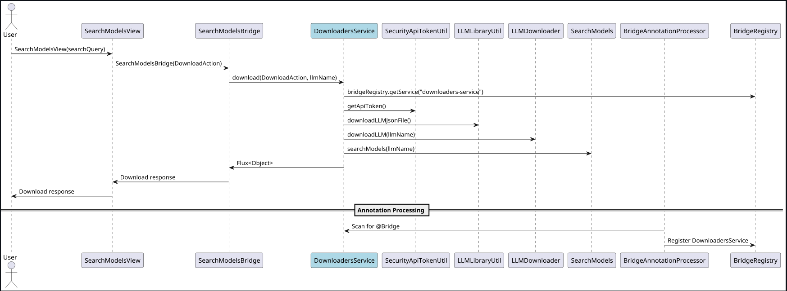
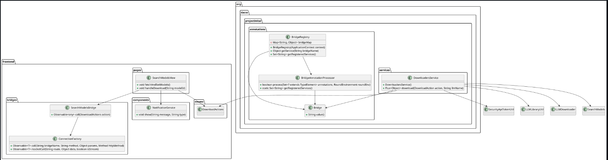

# ANNOTATIONS\_MODULE.md

## Overview

The `@Bridge` annotation is designed to facilitate seamless communication between front-end TypeScript 'bridge' classes and back-end services in a Spring Boot application. This annotation, when applied to a service class, enables automatic registration and mapping of the service, simplifying the process of exposing service methods as REST endpoints. The `@Bridge` classes were developed to be used in multi-module Maven projects.

## Purpose

The primary purpose of the `@Bridge` annotation is to:

1. **Automate Service Registration**: Automatically register annotated services in the `BridgeRegistry`, which maintains a map of service names to service instances.
2. **Simplify Front-end Integration**: Provide a straightforward way for front-end applications to interact with back-end services through TypeScript 'bridge' classes.

## Benefits

### 1. Reduced Boilerplate Code

The `@Bridge` annotation eliminates the need to manually register services and create API handlers for each service. 
This reduces boilerplate code and ensures that services are automatically exposed to the frontend. Without the `@Bridge` functionality, 
for a service with multiple options such as the below `Downloaders` switch cases, we would have to create controllers for each case.

### 2. Consistent API Exposure

The `@Bridge` annotation ensures that all services are exposed in a consistent manner, following the same conventions and patterns. This consistency makes it easier to maintain and extend the application.

### 3. Improved Maintainability

With the `@Bridge` annotation, changes to service classes are automatically reflected in the exposed API. This reduces the risk of discrepancies between the service implementation and its exposed API.

### 4. Enhanced Developer Productivity

Developers can focus on implementing business logic in their service classes without worrying about the underlying infrastructure for exposing these services as REST endpoints. This leads to faster development cycles and improved productivity.

## Sequence Diagram

The following sequence diagram illustrates the interaction between the front-end and back-end components when a user sends a message:



## Class Diagram

The following class diagram shows the relationship between the `@Bridge` annotation, the `BridgeRegistry`, the service classes, and the TypeScript frontend:



## Usage

To use the `@Bridge` annotation, follow these steps:

1. **Annotate your service class with `@Bridge("service-name")` and implement a public method**:
    ```java
    @Service
    @Bridge("downloaders-service")
    public class DownloadersService implements DownloadersIface {

        public DownloadersService() {}

        @Override
        public Flux<Object> download(DownloadAction action, String llmName) {
            Flux<Object> flux;
            try {
                flux = switch (action) {
                    case API_TOKEN -> SecurityApiTokenUtil.getApiToken();
                    case DOWNLOAD_LLM_JSON -> LLMLibraryUtil.downloadLLMJsonFile();
                    case DOWNLOAD_LLM_MODEL -> LLMDownloader.downloadLLM(llmName);
                    case SEARCH -> SearchModels.searchModels(llmName);
                };
            } catch (Exception downloadersServiceExc) {
                log.error("{}:", downloadersServiceExc.getMessage(), downloadersServiceExc);
                return Flux.empty();
            } finally {
                log.info("{}: {}", action, llmName);
            }
            return flux;
        }
    }
    ```

2. **Create the TypeScript bridge and import the connectionFactory**:
    ```typescript
    import { from, Observable } from "rxjs";
    import { map } from "rxjs/operators";
    import client from "./connection-factory";
    import { DownloadActions } from '../enums/download-actions';

    export const SearchModelsBridge
    = (action: DownloadActions): Observable<any> => {
    return from(
    client.call(
    "SearchModelsBridge",
    "download",
    { action })
    ).pipe(map(response => response));
    };
    ```

3. **The connection factory handles all mapping and connections**:
    ```typescript
    async function fetchServiceName(bridgeName: string): Promise<string> {
    const response = await instance.get(`/bridgeRegistry/${bridgeName}`);
    return response.data.serviceName;
    }

    function call<T = any>(
    bridgeName: string,
    method: string,
    params?: any,
    httpMethod: Method = "POST"
    ): Observable<T> {
    return from(fetchServiceName(bridgeName)).pipe(
    switchMap((serviceName: string) => {
    const url = `/${serviceName}/${method}`;

    const request = instance.request<T>({
    url,
    method: httpMethod,
    data: httpMethod === "POST" ? params : undefined,
    params: httpMethod !== "POST" ? params : undefined,
    });

    // Convert the Promise-based Axios request to an Observable
    return from(request.then((response) => response.data));
    })
    );
    }
    ```
4. **Call the bridge from your front-end component**:
    ```typescript
   import { SearchModelsBridge } from "../bridges/search-models-bridge";
   import { DownloadActions } from "../enums/download-actions";
   import { firstValueFrom } from "rxjs";
   
   // Usage of SearchModelsBridge in a function
   const fetchAndSetModels = async () => {
       try {
           const response = await firstValueFrom(SearchModelsBridge(DownloadActions.SEARCH));
           // Handle the response
       } catch (error) {
           console.error("Error fetching models:", error);
       }
   };
   
   const handleDownload = async (modelId: string) => {
       try {
           await firstValueFrom(SearchModelsBridge(DownloadActions.DOWNLOAD_LLM_MODEL));
           // Handle successful download
       } catch (error) {
           console.error("Error downloading model:", error);
       }
   };
    ```
   