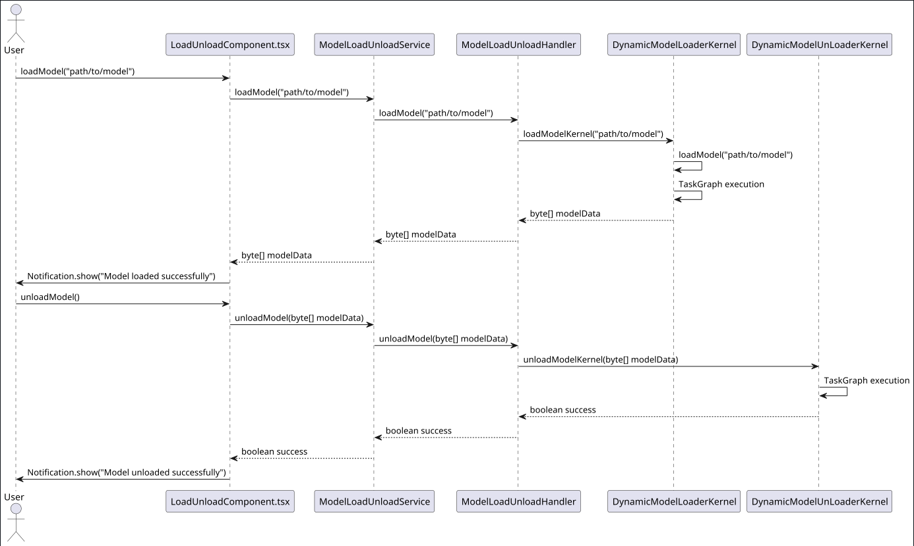

## Loaders Module (`loaders-mod`)

## Purpose

The `loaders-mod` module is designed to handle the dynamic loading and unloading of models onto and from the GPU. This module leverages the TornadoVM framework to optimize the execution of these operations on heterogeneous hardware, ensuring efficient performance.

## Functionality

### `ModelLoadUnloadService.java`

This service class acts as an endpoint for the front-end to interact with the model loading and unloading functionalities. It uses the `ModelLoadUnloadHandler` to perform the actual operations.

- **Methods:**
  - `loadModel(String modelPath)`: Loads a model from the specified path.
  - `unloadModel(byte[] modelData)`: Unloads the specified model data.

### `ModelLoadUnloadHandler.java`

This handler class coordinates the loading and unloading of models by interacting with the respective kernel classes.

- **Dependencies:**
  - `DynamicModelLoaderKernel`
  - `DynamicModelUnLoaderKernel`

- **Methods:**
  - `loadModel(String modelPath)`: Uses `DynamicModelLoaderKernel` to load a model.
  - `unloadModel(byte[] modelData)`: Uses `DynamicModelUnLoaderKernel` to unload a model.

### `DynamicModelLoaderKernel.java`

This kernel class is responsible for loading a model onto the GPU. It reads the model data from the file system and uses TornadoVM to transfer the data to the GPU.

- **Methods:**
  - `loadModelKernel(String modelPath)`: Loads the model data and transfers it to the GPU.
  - `loadModel(String modelPath)`: Reads the model data from the specified path.
  - `getModel()`: Returns the loaded model data.

### `DynamicModelUnLoaderKernel.java`

This kernel class handles the unloading of a model from the GPU. It uses TornadoVM to reset the model data on the GPU.

- **Methods:**
  - `unloadModelKernel(byte[] modelData)`: Unloads the model data from the GPU.
  - `unloadModel(byte[] modelData)`: Public method to initiate the unloading process.

## Summary

The `loaders-mod` module provides a comprehensive solution for dynamically loading and unloading models onto and from the GPU. It ensures efficient performance by leveraging the TornadoVM framework and provides a seamless interface for front-end interaction through the `ModelLoadUnloadService` class.

## Sequence Diagram

